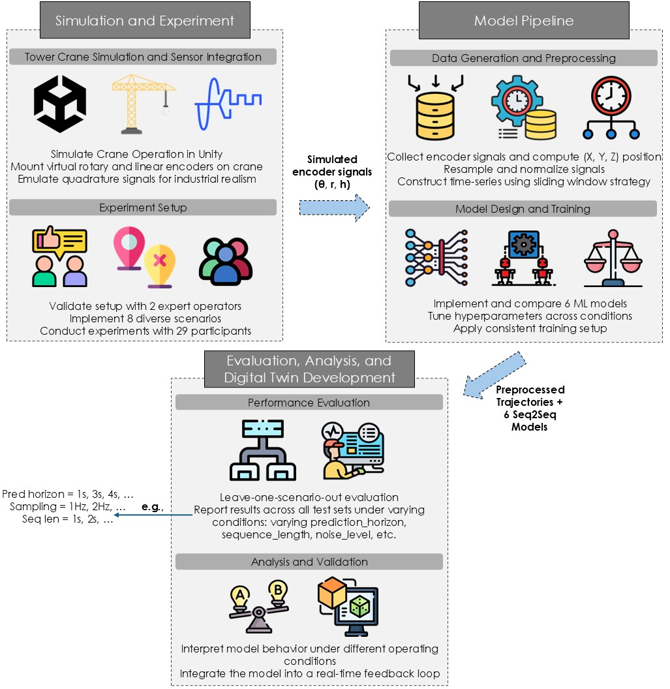
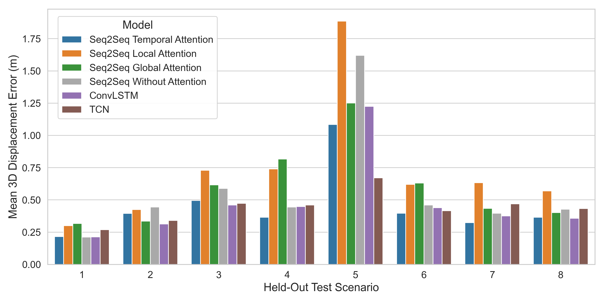
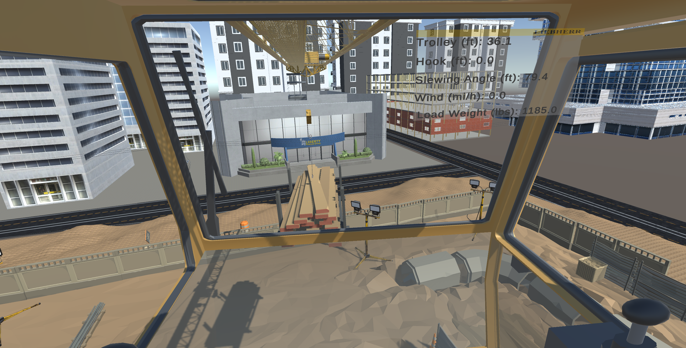
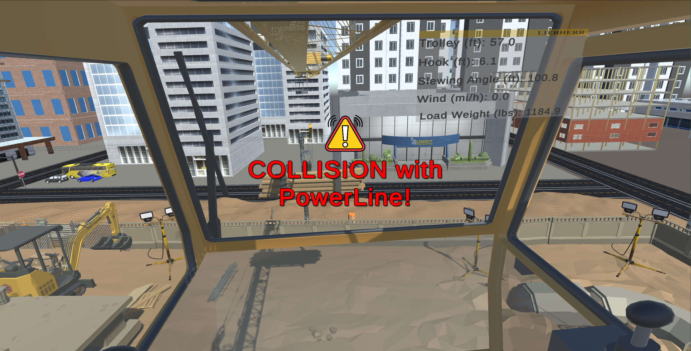

# Generalizable Deep Sequence Models for 4D Trajectory Prediction of Tower Crane Loads

This repository contains the code for the paper:

> "Generalizable deep sequence models for 4D trajectory prediction of tower crane loads."  
> Mohammad Hossein Kazemi et al.,
> *Automation in Construction*, 182, 106696, 2026.  
> DOI: https://doi.org/10.1016/j.autcon.2025.106696

The project predicts the future 3D position of suspended tower-crane loads over time using human-operated crane trajectories collected in a Unity-based digital twin. The paper evaluates Seq2Seq attention models, ConvLSTM, and TCN models under unseen logistics scenarios, different prediction horizons, sampling rates, input windows, and sensor noise. The best reported model is `Seq2SeqTemporalAttention`, with a 0.45 m mean 3D displacement error on unseen logistics scenarios.

## Overview

<p align="center">
  
</p>

<p align="center">
  
</p>

<p align="center">
  
  
</p>

## Repository Structure

```text
Preprocessing/   Data loading, scaling, scenario splitting, and sequence generation
Training/        Model implementations and training loops
Unity_Scripts/   Unity C# scripts for crane simulation, different scenarios, eye-tracking (Tobii and Oculus), VR and desktop experiments, data capture, and more
utils/           Evaluation, plotting, logging, and prediction utilities
main.py          Example training entry point
requirements.txt Python dependencies
```

## Setup

```powershell
python -m venv .venv
.\.venv\Scripts\Activate.ps1
pip install -r requirements.txt
```

The pinned PyTorch dependency targets CUDA 11.8. If you use a different CUDA version or CPU-only PyTorch, install the matching PyTorch build before running the project.

## Citation

```bibtex
@article{KAZEMI2026106696,
  title = {Generalizable deep sequence models for 4D trajectory prediction of tower crane loads},
  journal = {Automation in Construction},
  volume = {182},
  pages = {106696},
  year = {2026},
  issn = {0926-5805},
  doi = {https://doi.org/10.1016/j.autcon.2025.106696},
  url = {https://www.sciencedirect.com/science/article/pii/S0926580525007368},
  author = {Mohammad Hossein Kazemi and Yuqing Hu and Yi Wu and John I. Messner and Scarlett R. Miller},
  keywords = {Tower cranes trajectory prediction, Sequence-to-sequence models, Attention mechanisms, Digital twin, Virtual reality}
}
```

## Acknowledgment

This work was supported by the U.S. National Science Foundation under Grant No. 2222730.
